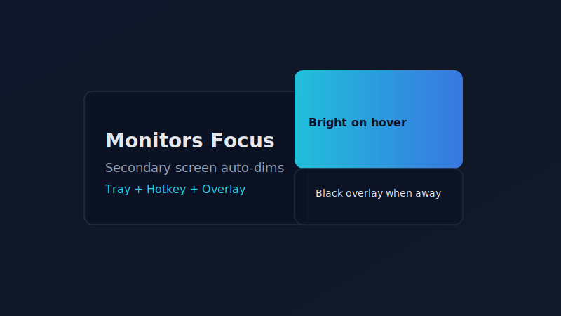

# Monitors Focus | [English](README.md)

  

✅ **托盘常驻 | 全局暂停/恢复热键 | 纯黑点击穿透遮罩**  
✅ **光标进入副屏即刻亮屏 | 返回主屏延迟熄屏（默认 180 秒，可自定义）**  
✅ **Windows 10/11 | 双/三屏布局 | 不改变窗口位置**  

Monitors Focus 是一款轻量级 Windows 托盘应用，通过纯黑、点击穿透的遮罩自动熄灭选定副屏，光标移入立即点亮，返回主屏后按设定延迟再次变黑。

<p align="center">
  
</p>

## 功能

| 功能 | 描述 |
| :--- | :--- |
| ✨ 鼠标跟随黑屏 | 实时跟踪光标，按可配置延迟（默认 180 秒）自动遮罩选定副屏。 |
| 🛡️ 点击穿透 | 纯黑顶置窗口，不抢焦点，不出现在 Alt-Tab/任务栏，鼠标可穿透。 |
| ⚙️ 快速设置 | 托盘设置：延迟、透明度、监控屏选择、全局热键（默认 Ctrl+F12）、开机自启，支持中英文即时切换。 |
| 🎛️ 随时暂停 | 热键或托盘菜单一键暂停/恢复自动化；左键托盘可直接打开设置。 |
| 💡 硬件调光（可选） | DDC/CI 优先（外接），失败回退 WMI（部分内屏）；不支持则自动回退遮罩。 |
| 🧪 能力诊断 | 显示每屏硬件调光状态，可单屏禁用并支持重检（保存后生效）。 |
| 🪟 灵活界面 | 更大的可调整尺寸窗口并记忆大小，控件加宽更清晰。 |

## 使用方法
1. 构建或下载 `MonitorsFocus.exe`（构建方法见下方 Developer Guide）。
2. 运行后左键托盘（或右键→Settings）打开设置，选择受控屏、延迟、透明度、热键、语言和调光模式（自动/仅遮罩/仅硬件）。
3. 在主屏工作，返回主屏后按延时黑屏，鼠标移入副屏立即亮屏；支持硬件的屏幕会降低背光，不支持的屏幕使用遮罩。

<details>
  <summary>运行环境与限制</summary>

  - Windows 10/11 (x64)，自包含发布已含运行时。
  - 为双/多屏设计，支持 PerMonitorV2 DPI 缩放。
  - 硬件调光依赖显示器支持（外接 DDC/CI；部分内屏 WMI），否则回退遮罩。
</details>

<details>
  <summary>Developer Guide</summary>

  ```bash
  dotnet restore
  dotnet build
  dotnet run --project src/MonitorsFocus
  # 单文件发布
  dotnet publish src/MonitorsFocus -c Release -r win-x64 ^
    -p:PublishSingleFile=true -p:UseAppHost=true -p:SelfContained=true ^
    -p:IncludeNativeLibrariesForSelfExtract=true -p:PublishTrimmed=false ^
    -o publish/win-x64
  ```
</details>

<details>
  <summary>开发栈</summary>

  1. Packages & Frameworks: .NET 8, WinForms  
  2. Interfaces & Services: Windows user32 APIs（`RegisterHotKey`、分层窗体）  
  3. Languages: C#
</details>

<details>
  <summary>License</summary>

  License: MIT。
</details>

<details>
  <summary>FAQ / 故障排查</summary>

  - 热键无效？可能被其他应用占用，请在 Settings 中更换热键。  
  - 副屏未熄？检查设置中是否勾选对应显示器，延迟是否为 0（需要立即熄屏时设为 0）。  
  - 遮罩抢焦点？遮罩使用不激活窗口样式，如仍有问题可通过热键暂停/恢复重置状态。  
</details>

## 🤝 贡献与联系

欢迎提交 Issue 和 Pull Request！  
如有任何问题或建议，请联系 Zheyuan (Max) Kong (卡内基梅隆大学，宾夕法尼亚州)。

Zheyuan (Max) Kong: kongzheyuan@outlook.com | zheyuank@andrew.cmu.edu
