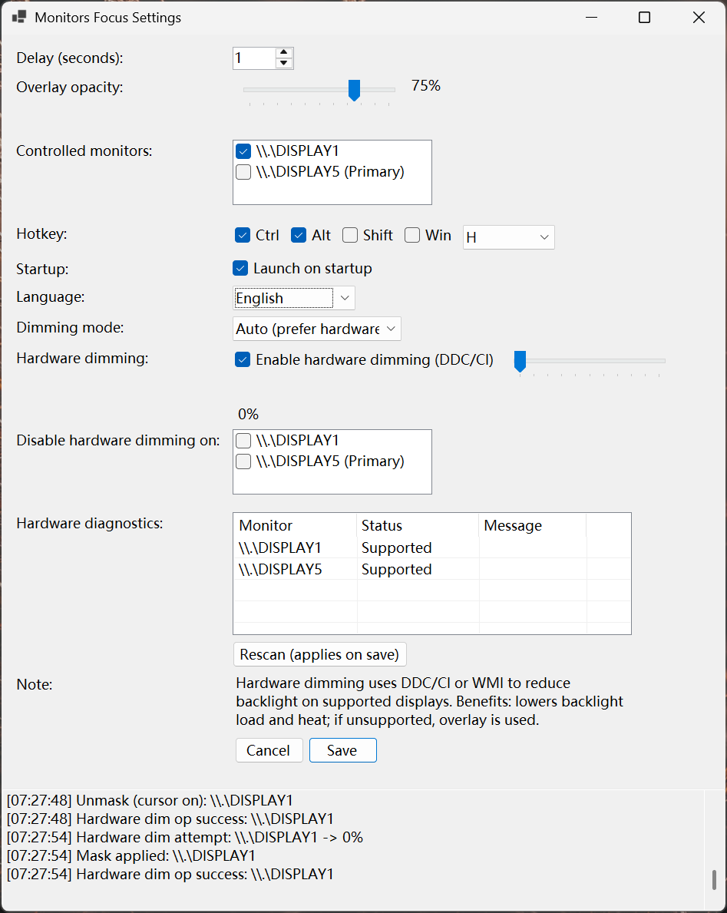
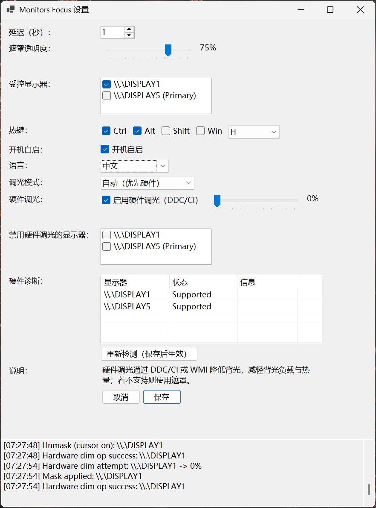

# Monitors Focus | [中文](README-zh.md)

  

✅ **Tray-first, no main window | Pause/Resume hotkey | Background RAM usage: ~10MB.**  
✅ **Instant wake when cursor enters secondary | Auto-dim after delay on primary**  
✅ **Windows 10/11 | Dual/tri monitor layouts | No window rearrange**  

Monitors Focus is a lightweight Windows tray app that auto-dims selected secondary monitors with a pure black, click-through overlay. It wakes the screen instantly when your cursor enters and darkens it again after a delay when you return to the primary display.

<p align="center">
  <a href="https://github.com/MaxMiksa/Monitors-Focus-Assistant/releases/download/v1.0.0/MonitorsFocus.exe">
    
  </a>
</p>

## Features

| Feature | Description |
| :--- | :--- |
| ✨ Mouse-follow dimming | Tracks cursor and auto-masks selected non-primary monitors after a configurable delay (default 180s). |
| 🛡️ Click-through overlay | Pure black, topmost, non-activating, hidden from Alt-Tab/taskbar; does not steal clicks. |
| ⚙️ Quick settings | Tray settings for delay, opacity, monitor selection, global hotkey (Ctrl+F12 default), launch on startup, bilingual UI (live switch). |
| 🎛️ Pause anytime | Global hotkey or tray menu instantly pauses/resumes automation; left-click tray opens Settings. |
| 💡 Hardware dimming (optional) | DDC/CI with WMI fallback on supported monitors; auto-falls back to overlay if unsupported. |
| 🧪 Diagnostics | Per-monitor hardware dim status, manual disable list, and rescan (applies on save). |
| 🪟 Flexible UI | Larger resizable Settings window with size memory; controls widened for clarity. |

## Usage
1. Build or download `MonitorsFocus.exe` (see Developer Guide below for build).
2. Run the app: left-click the tray icon (or right-click → Settings) to choose monitors, delay, opacity, hotkey, language, and dimming mode (Auto/Overlay-only/Hardware-only).
3. Work on your primary screen; the selected secondary screens will black out after the delay and wake instantly when you move the cursor onto them. Hardware dimming lowers backlight on supported monitors; overlay remains the fallback.

<p align="center">
  
  
</p>

## Related Info
<details>
  <summary>Requirements & Limits</summary>

  - Windows 10/11 (x64); self-contained publish includes runtime.
  - Designed for 2+ monitors; works with PerMonitorV2 DPI scaling.
  - Hardware dimming depends on monitor support (DDC/CI external displays; WMI for many laptops); otherwise overlay is used.
</details>

<details>
  <summary>Developer Guide</summary>

  ```bash
  dotnet restore
  dotnet build
  dotnet run --project src/MonitorsFocus
  # Single-file publish
  dotnet publish src/MonitorsFocus -c Release -r win-x64 ^
    -p:PublishSingleFile=true -p:UseAppHost=true -p:SelfContained=true ^
    -p:IncludeNativeLibrariesForSelfExtract=true -p:PublishTrimmed=false ^
    -o publish/win-x64
  ```
</details>

<details>
  <summary>Development Stack</summary>

  1. Packages & Frameworks: .NET 8, WinForms
  2. Interfaces & Services: Windows user32 APIs (`RegisterHotKey`, layered windows)
  3. Languages: C#
</details>

<details>
  <summary>License</summary>

  License: MIT.
</details>

<details>
  <summary>FAQ / Troubleshooting</summary>

  - Hotkey not working? Another app may own it—change the hotkey in Settings.
  - Secondary not dimming? Check the monitor checklist in Settings and ensure delay is not 0 if you expect an immediate dim.
  - Overlay steals focus? Overlays are non-activating (`WS_EX_NOACTIVATE`); if you still see focus issues, try pausing/resuming via hotkey to reset.
</details>

## 🤝 Contribution & Contact

Welcome to submit Issues and Pull Requests!
Any questions or suggestions? Please contact Zheyuan (Max) Kong (Carnegie Mellon University, Pittsburgh, PA).

Zheyuan (Max) Kong: kongzheyuan@outlook.com | zheyuank@andrew.cmu.edu
